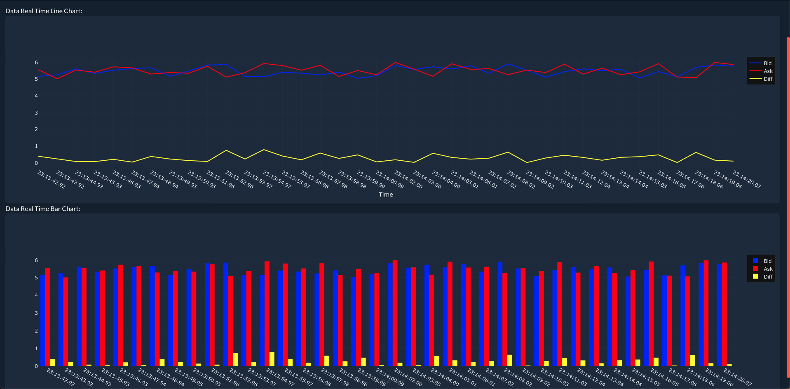
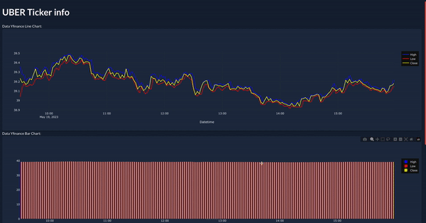
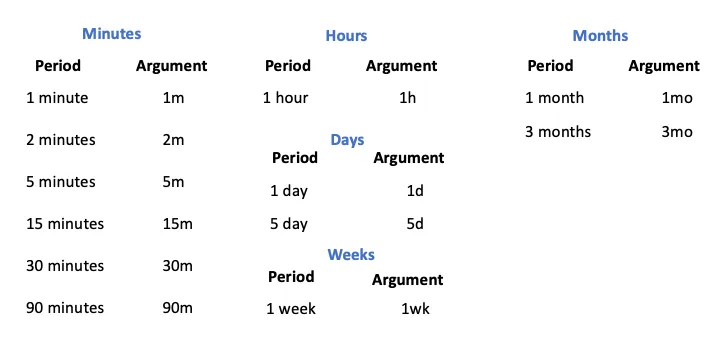

# Web feed charts plot - POC 

#### Page Demo

#### Uber ticker page

Okay since we're going to use yfinance to get our tickers data, there is some things you need to get in order to generate those info. The following image contains the period and interval parameters to download the yfinance data (used at the make gendatacsv target)

Let's say you need to get data from the ticker UBER, from 5 days and interval of 2 minutes. you should use the argument period --> 5d and interval --> 2m

## To run the project follow the steps:

### First of all run the command below to generate the data.csv
    $ make gendatacsv

After a while just go to the next steps

### If its the first time using it after the data gen run the command:
	$ make buildrunfirstime

### After the first time just run:
	$ make buildrun

# FOR COLLABORATORS

## If you want to send a pr, always remember to run the command to clean the data (in case you use git add . * Try not to :D *):
	$ make cleandata
